```mermaid
graph TD
    User[User Thread] -->|Small Alloc| TH[ThreadHeap - TLS]
    User[Large Alloc > 256KB] -->|Direct| CH[CentralHeap - Global]

    subgraph "Level 1: Thread Local (Lock-Free)"
        TH --> SCP[SizeClassPools]
        SCP --> Slab[Active Slab]
        Slab -->|Bump Alloc| Ptr[Returned Pointer]
    end
    
    subgraph "Level 2: Global Management (Locked/Atomic)"
        TH -->|Slab Exhausted| CH
        CH --> FL[Global Span FreeLists]
        CH --> Chunk[Chunk Metadata]
    end

    subgraph "Level 3: System"
        CH -->|mmap/munmap| OS[OS Kernel]
    end

    %% 注释补充
    classDef highlight fill:#f9f,stroke:#333,stroke-width:2px;
    class TH,SCP highlight;
```

# TierAlloc

**TierAlloc** 是一个高性能、并发感知的 C++17 内存分配器 (Memory Allocator)。

它采用了类似于 `tcmalloc` 和 `jemalloc` 的多级缓存架构，专为高并发环境下的低延迟内存分配而设计。通过将内存管理分层为 **Thread Local Cache (无锁)** 和 **Central Global Heap (有锁)**，TierAlloc 极大地减少了多线程环境下的锁竞争。


-yellow.svg)

---

## 🚀 核心特性 (Features)

TierAlloc 旨在解决标准 `malloc/free` 在多核系统中的性能瓶颈。

*   **⚡ 极速热路径 (Fast Path)**:
    *   小对象分配直接从线程本地缓存 (`ThreadChunkCache` / `SizeClassPool`) 获取，完全**零锁 (Lock-Free)**。
    *   仅需简单的指针移动和链表操作，纳秒级响应。

*   **🏗️ 三层架构设计**:
    1.  **ThreadHeap**: 线程私有堆，处理绝大多数分配请求。
    2.  **CentralHeap**: 全局中央堆，负责向各个线程批发内存块 (Slab)，并在线程间平衡内存。
    3.  **PageHeap**: 底层页管理，负责与操作系统 (`mmap/munmap`) 交互，管理 2MB 大页对齐。

*   **🧩 智能内存布局**:
    *   **Slab Allocation**: 针对小对象采用 Slab 算法，减少内部碎片。
    *   **Metadata Integration**: 采用侵入式元数据，通过 `Address & Mask` 快速定位 `SlabHeader`，无需额外的哈希表查找。
    *   **Strict Alignment**: 强制 2MB 对齐，降低 TLB Miss 率。

*   **🛡️ 并发安全**:
    *   支持多线程环境下的 `alloc/free`。
    *   实现了 **Remote Free** 机制：允许线程 A 分配的内存由线程 B 释放（使用原子链表实现）。

---

## 📊 架构概览 (Architecture)



---

## ⚠️ 已知限制 (Known Limitations)

为了保证项目的交付进度和核心功能的稳定性，当前版本在设计上做出了以下**权衡 (Trade-offs)**。请在集成前仔细阅读。

### 1. 线程退出时的内存泄漏 (Safe Leak Strategy)
**现象**：
当一个线程退出时，如果它分配的内存块（Slab）中仍有对象被其他活跃线程持有，TierAlloc **不会** 尝试强制回收该 Slab。
相反，这些 Slab 会被标记为“遗弃”状态，从而导致**内存泄漏**（直到进程结束）。

**原因 (Design Rationale)**：
这是为了防止 **Use-After-Free** 和 **SegFault**。
如果线程 T1 退出时强制 `munmap` 销毁所有 Slab，而线程 T2 仍持有 T1 分配的指针，当 T2 稍后访问或释放该指针时，会导致程序崩溃。为了“活着（Leak）”而不是“崩溃（Crash）”，我们选择了前者。

**建议**：
*   ✅ **推荐场景**：**线程池 (Thread Pool)** 架构。线程长时间存活并复用，极少发生线程销毁。
*   ❌ **不推荐场景**：频繁创建和销毁短生命周期线程的任务。

### 2. 仅支持 Linux
依赖 `mmap`, `pthread`, `__builtin_ctz` 等特性，未适配 Windows/macOS。

### 3. 无全自动垃圾回收 (No GC)
这是一个 C++ 分配器，用户必须手动调用 `deallocate`，或者结合 RAII/智能指针使用。

---

## 🛠️ 构建与测试 (Build & Test)

项目使用 CMake 构建，并集成 GoogleTest 进行单元测试。

### 环境要求
*   Linux (WSL2/Ubuntu 20.04+)
*   GCC 9+ / Clang 10+
*   CMake 3.10+

### 编译

```bash
mkdir build && cd build
# 建议开启 Release 模式以测试性能
cmake -DCMAKE_BUILD_TYPE=Release ..
make -j$(nproc)
```

### 运行测试

我们提供了涵盖基本分配、大内存压力、并发竞争的完整测试集。

```bash
# 运行所有测试
./tests/run_tests

# 运行特定的并发压力测试
./tests/run_tests --gtest_filter=ThreadHeapTest.ProducerConsumer_Stress
```

> **注意**：如果使用 Valgrind 检测，会报告 "Definitely lost" 或 "Still reachable"，这符合上述的“安全泄漏策略”。只要没有 "Invalid read/write"，即视为正常。

---

## 📝 快速开始 (Quick Start)

```cpp
#include "TierAlloc/ThreadHeap/ThreadHeap.hpp"

void example() {
    // 1. 初始化（每个线程首次使用前自动或手动调用）
    // ThreadHeap::Init(); 

    // 2. 分配小对象 (无需锁)
    void* ptr = ThreadHeap::allocate(32);

    // 3. 使用内存...
    
    // 4. 释放内存 (支持本地释放或跨线程释放)
    ThreadHeap::deallocate(ptr);
}
```

---

## ⚖️ 许可证 (License)

本项目采用 MIT License 开源。

---

**Developed for CaSTM Transactional Memory System Prototype.**