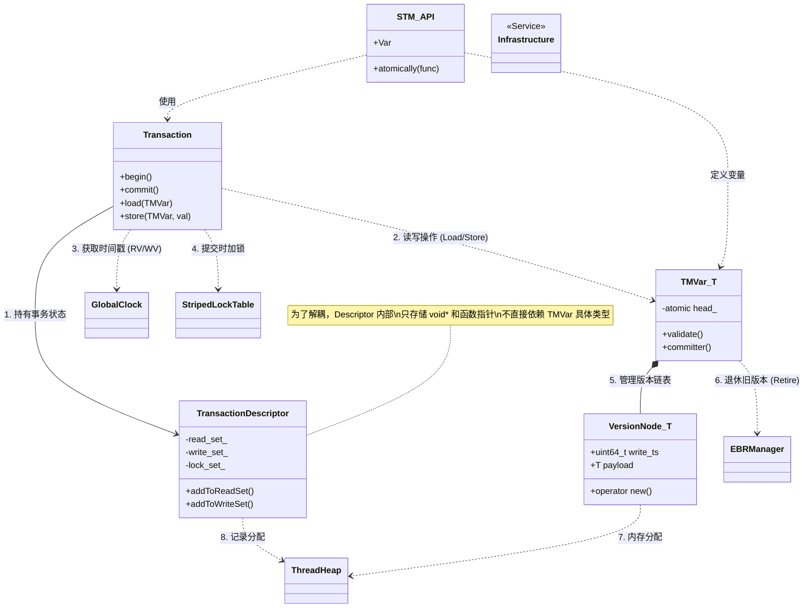

# CaSTM - C++ Atomic Software Transactional Memory

**CaSTM** 是一个高性能的 C++ 软件事务内存（STM）原型库。它采用了 **MVCC（多版本并发控制）** 和 **EBR（基于周期的内存回收）** 技术，为开发者提供了一种无锁读取、自动冲突检测的并发编程模型。

## 🏗 系统架构与模块依赖

CaSTM 采用分层架构设计，模块之间职责分明。下图展示了核心组件之间的依赖关系：



### 模块依赖简述

1.  **Transaction (核心引擎)**：
    *   **依赖**：`TransactionDescriptor`（存储状态）、`GlobalClock`（获取版本号）、`StripedLockTable`（写操作加锁）。
    *   **交互**：通过模版方法 `load<T>` / `store<T>` 与 `TMVar` 交互。它负责编排事务的 `begin`、验证（Validation）和 `commit` 流程。

2.  **TransactionDescriptor (状态容器)**：
    *   **职责**：维护事务的 **读集 (ReadSet)**、**写集 (WriteSet)** 和 **分配集 (AllocationSet)**。
    *   **解耦设计**：为了避免头文件循环依赖，它不直接引用 `TMVar`，而是存储 `void*` 指针和静态回调函数（`Validator`, `Committer`）。

3.  **TMVar & VersionNode (数据结构)**：
    *   **TMVar**：用户视角的共享变量。内部维护一个指向 `VersionNode` 的原子指针 `head_`。它提供静态的 `validate`（验证）和 `committer`（提交）函数供事务引擎回调。
    *   **VersionNode**：实际存储数据的节点，包含 `write_ts`（写入时间戳）和 `prev`（前驱指针）。
    *   **依赖**：`VersionNode` 重载了 `new/delete`，直接依赖 `ThreadHeap` 进行内存分配。`TMVar` 依赖 `EBRManager` 来安全地回收被切断的旧链表节点。

4.  **Infrastructure (基础设施)**：
    *   **GlobalClock**：提供全局单调递增的时间戳。
    *   **StripedLockTable**：基于哈希的条带锁，用于在 Commit 阶段保护写集，避免死锁。
    *   **EBRManager**：解决 ABA 问题和内存释放时的并发安全问题。
    *   **ThreadHeap**：线程局部内存池，加速小对象的分配与释放。

---

## 🚀 快速开始

### 1. 定义共享变量
使用 `STM::Var<T>` 定义需要在线程间共享的数据。

```cpp
#include "STM.hpp"

struct Account {
    int id;
    int balance;
};

// 定义一个共享的账户变量
STM::Var<Account> shared_account(1, 100);
```

### 2. 执行事务
使用 `STM::atomically` 包裹业务逻辑。Lambda 接收 `Transaction&` 句柄。

```cpp
void update_account(int money) {
    STM::atomically([&](Transaction& tx) {
        // 1. 读取 (Load)
        // 返回的是 Account 的值拷贝
        Account acc = tx.load(shared_account);

        // 2. 修改 (Local Modification)
        acc.balance += money;

        // 3. 写入 (Store)
        // 此时并未修改全局数据，而是写入了 TransactionDescriptor 的写集
        tx.store(shared_account, acc);
    });
    // Lambda 结束时自动 Commit。如果冲突，自动重试。
}
```

### 3. 内存管理
在事务中分配内存应使用 `tx.alloc<T>`，确保事务回滚时内存能被自动回收。

```cpp
STM::atomically([&](Transaction& tx) {
    // 类似于 new int(42)，但受事务管理
    int* ptr = tx.alloc<int>(42);
    
    // ... 使用 ptr ...
    
    // 如果事务 Abort，ptr 会被自动 delete，不会内存泄漏
});
```

---

## ⚙️ 编译与集成

本项目基于 **C++17** 标准。

### 目录结构
```text
.
├── include/
│   ├── STM.hpp                # 聚合头文件
│   ├── Transaction.hpp        # 事务核心逻辑
│   ├── TransactionDescriptor.hpp # 事务状态描述符
│   ├── TMVar.hpp              # 事务变量模版
│   ├── VersionNode.hpp        # 多版本节点 (detail)
│   ├── GlobalClock.hpp        # 全局时钟
│   ├── StripedLockTable.hpp   # 条带锁表
│   └── TierAlloc/             # 内存分配器组件
├── src/
│   ├── Transaction.cpp        # 事务的非模版实现 (Commit/Validate逻辑)
│   ├── GlobalClock.cpp
│   └── ...
└── tests/
```

### 编译要求
*   C++ Standard: **C++17**
*   Compiler: GCC 9+, Clang 10+, MSVC 2019+
*   System: Linux (推荐), Windows, macOS

```bash
mkdir build && cd build
cmake ..
make -j4
```